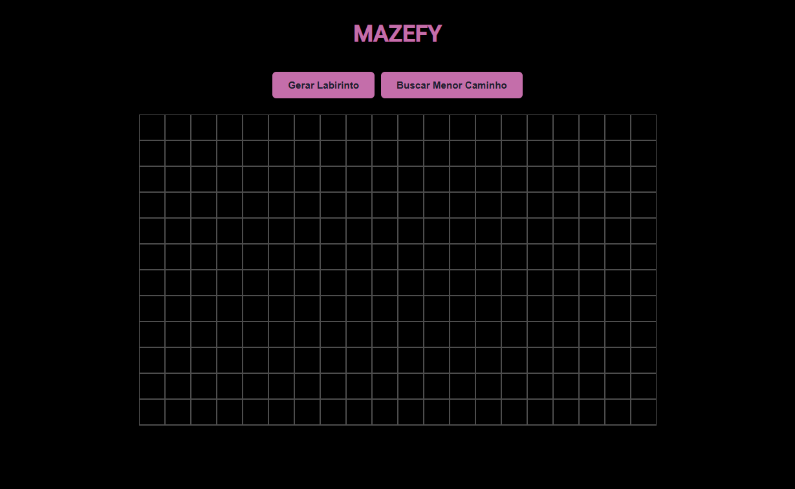
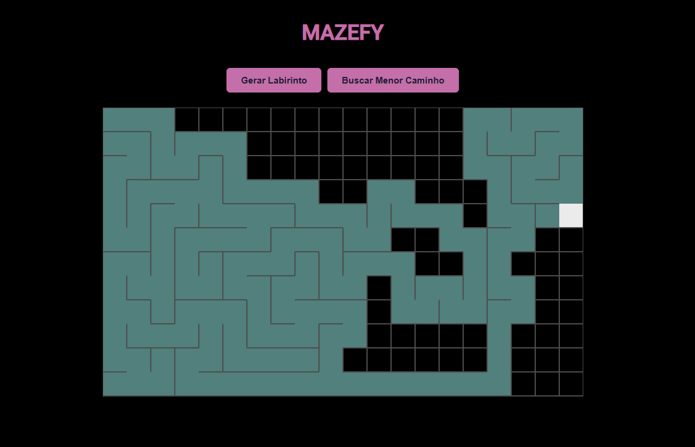
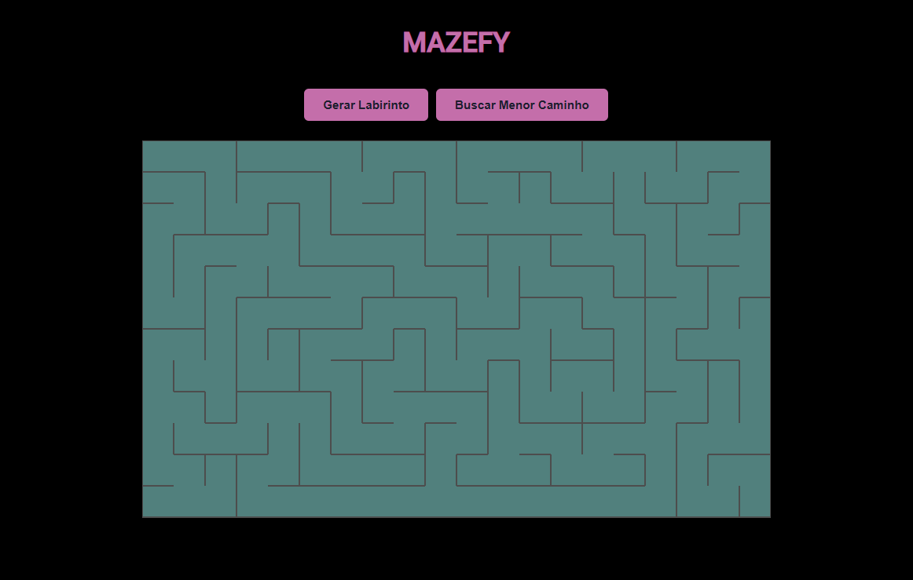
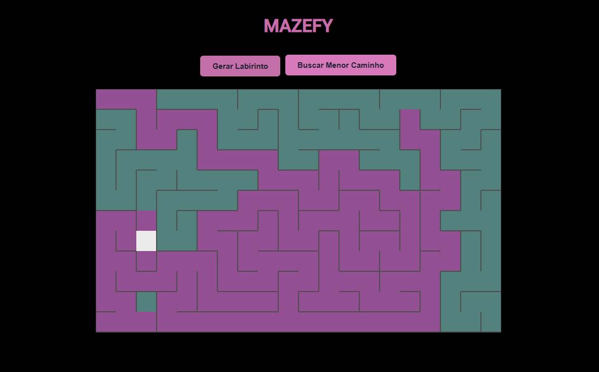
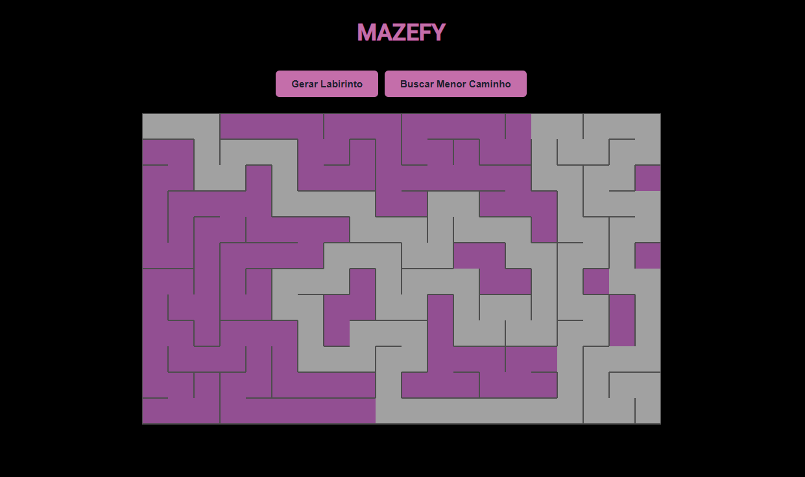

# Mazefy

> Visualização de geração e solução de labirintos utilizando algoritmos de busca em grafos (DFS e BFS).

## Alunos

| Matrícula  |                              Nome                              |
| :--------: | :------------------------------------------------------------: |
| 20/0054333 | [Arthur Gabriel Lima Gomes](https://github.com/ArthurGabrieel) |
| 19/0025581 |      [Bruno Oliveira Lima](https://github.com/eng-Bruno)       |

## Descrição do projeto

O objetivo deste projeto é demonstrar, de forma visual e interativa, a aplicação prática de algoritmos como Busca em Profundidade e Busca em Largura. O Mazefy simula um labirinto que atua como um grafo, onde cada célula representa um nó e as paredes representam a ausência de arestas.

O projeto foi dividido em duas etapas lógicas principais:

1.  **Geração do Labirinto:** Utiliza o algoritmo Busca em Profundidade (DFS), especificamente a variação de Backtracking Recursivo, para criar um labirinto onde existe exatamente um caminho único entre quaisquer dois pontos.
2.  **Solução do Menor Caminho:** Utiliza o algoritmo Busca em Largura (BFS) para explorar o grafo camada por camada e garantir a descoberta do caminho mais curto entre o ponto inicial e o final.

## Guia de instalação

O projeto foi desenvolvido utilizando tecnologias web nativas, garantindo portabilidade e facilidade de execução sem a necessidade de gerenciadores de pacotes complexos.

### Dependências do projeto

**Linguagens utilizadas:**

- HTML5
- CSS3
- JavaScript

### Como executar o projeto

Acesse: [Mazefy](https://edaii.github.io/Grafos_Mazefy/)

> ou

1.  Clone este repositório em sua máquina local:
    ```bash
    git clone https://github.com/EDAII/Grafos_Mazefy.git
    ```
2.  Navegue até a pasta do projeto.
3.  Abra o arquivo `index.html` diretamente no navegador.

## Capturas de tela

Abaixo estão demonstrados os estágios de funcionamento da aplicação.

### 1. Geração via DFS (Backtracking)




### 2. Solução via BFS (Busca em Largura)




### 3. Caminho Encontrado



## Conclusões

A implementação demonstrou com clareza as características distintas de cada algoritmo:

- **Busca em Profundidade:** Mostrou-se ideal para a geração de labirintos. Sua natureza de "ir o mais fundo possível" antes de retroceder cria corredores longos e complexos, resultando em labirintos esteticamente interessantes e desafiadores, garantindo que todas as células sejam visitadas.
- **Busca em Largura:** Provou ser o algoritmo ótimo para a resolução em grafos não direcionados. Ao explorar os vértices em "ondas" a partir da origem, o BFS garante matematicamente que o primeiro caminho encontrado até o destino é o de menor custo (menor número de passos).

## Apresentação

